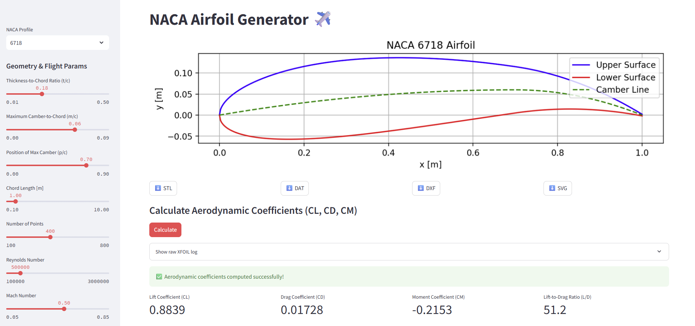

# NACA Airfoil Generator ✈️

Interactive Streamlit app that lets you **design a NACA 4‑digit airfoil and instantly predict its aerodynamic performance** using the classic XFOIL solver.


---

## Features

| Section      | What you can do                                                                                                              |
| ------------ | ---------------------------------------------------------------------------------------------------------------------------- |
| **Geometry** | Pick thickness ratio `t/c`, maximum camber `m/c`, location of camber `p/c`, chord length and number of discretisation points |
| **Flight**   | Set Reynolds, Mach and angle of attack                                                                                       |
| **Plot**     | Dynamic zoom (two buttons) to inspect the shape without wasting screen estate                                                |
| **Download** | Get a plain‑text `airfoil.dat` with upper & lower coordinates (ready for CAD or other solvers)                               |
| **XFOIL**    | One‑click computation of CL, CD, CM + L/D, with the full XFOIL log available for debugging                                   |

---

## Running locally

```bash
# clone repo
pip install -r requirements.txt  # streamlit, numpy, matplotlib
# make sure xfoil/xfoil.exe is present (or symlinked) inside the project
streamlit run naca_airfoil_generator.py
```

*On Windows* you can drop `xfoil.exe` in the `xfoil/` folder.
*On Linux* compile Drela’s source and place the binary there (remember to chmod +x).

---

## File layout

```
├─ naca_airfoil_generator.py   # Streamlit app (UI + logic)
├─ xfoil/                      # directory that holds xfoil.exe (or just xfoil)
│   └─ xfoil.exe
├─ airfoil.dat                 # generated at runtime – geometry
├─ input_file.in               # runtime – commands sent to XFOIL
├─ polar_file.txt              # runtime – coefficients returned by XFOIL
└─ README.md                   # this file
```

---

## Output explained

* **CL** – lift coefficient at the chosen α, Re, M.
* **CD** – drag coefficient (includes viscous and pressure drag).
* **CM** – pitching moment about c/4.
* **L/D** – aerodynamic efficiency (bigger is better).

The raw `polar_file.txt` is also saved so you can parse additional fields (e.g.
CDp, transition points) or accumulate multiple angles to build a full polar.

---

## Why airfoil.dat matters

`airfoil.dat` is the de‑facto exchange format for airfoil coordinates: first all upper‑surface points from TE→LE, then lower surface from LE→TE.  Feed it to XFOIL with `LOAD`, import into CAD lofts, or share it with colleagues via Git – it’s just text.

---

## License

The wrapper code is MIT.  XFOIL itself is GPL‑compatible *but ships separately* – see Drela & Youngren’s license in the source distribution.
